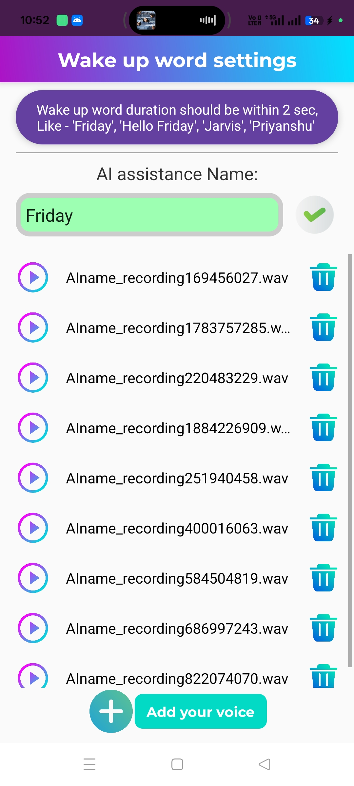

# FRIDAY – AI Voice Assistant App

FRIDAY is an Android-based AI voice assistant that responds to a custom wake word and executes user commands such as opening apps, fetching information, and setting reminders. Built with Kotlin, BERT NLP, Google Cloud API, Firebase, and TensorFlow Lite for wake-word detection.

## 🚀 Key Features
- Wake-word detection using TensorFlow Lite
- Natural conversation handling with BERT NLP
- Speech-to-text processing via Google Cloud API
- Secure cloud storage & authentication with Firebase
- Executes tasks like opening apps, answering queries, and managing reminders

## 🛠 Tech Stack
- **Android Studio** (Kotlin)
- **BERT NLP** for intent recognition
- **Google Cloud API** for speech services
- **Firebase** for cloud storage & authentication
- **TensorFlow Lite** for wake-word detection

## 🎥 Live Demo  
<a href="https://drive.google.com/file/d/1MB0px0Ad6Fr7D4NvQJAu6gG7mB6tE9W-/view?usp=sharing" target="_blank">
<strong>Click Here to Watch Demo Video</strong>
</a>

## 📸 Screenshots
  

## 📦 Installation
1. Download the APK from the [Releases](https://github.com/Tanmay759484/FRIDAY-AI-Voice-Assistant-App/releases) section
2. Install on your Android device
3. Grant required permissions and say the wake word to start
